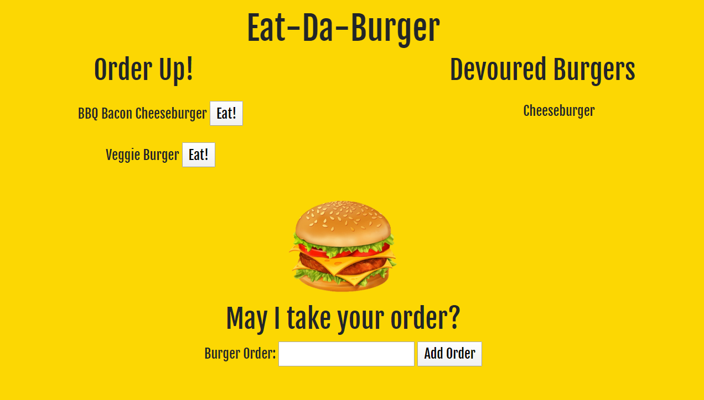

# Eat-Da-Burger
## Created By
Created by Samantha Considine. Sole developer.

## About

Created an application that logs burger orders and allows user to input a burger of their choice. All burgers that are available to be eaten have a button that changes their state from ordered to devoured.

Deployed to Heroku at the site: https://blooming-wildwood-99908.herokuapp.com/

## Technology Used
* HTML
* CSS
* JavaScript
* Node.js
* MySQL
* ORM
* npm packages:
    - express
    - express handlebars
    - mysql